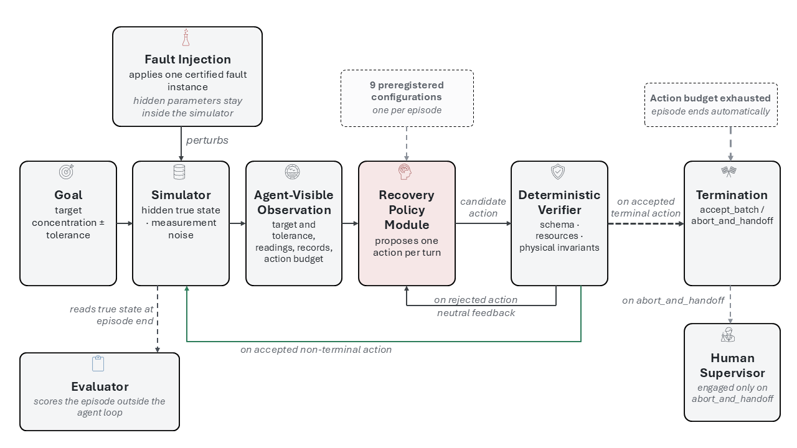

# SBLFR-Chem

**Simulation-Bound Lab Fault Recovery for chemistry labs.** An LLM agent proposes typed lab
actions inside a simulated wet-lab. A fault is injected inside the environment (not as text),
and a deterministic verifier gates every action before it commits. The benchmark measures
whether the agent recovers the target preparation, and separately whether it stays safe, under
under- and over-delivery, mislabelled stocks, wrong-species reagents, and miscalibrated
instruments.

The research question is not "can agents recover" but "where do multi-agent or prompting gains
actually come from". Every architecture (self-consistency, best-of-N, critic review,
heterogeneous teams) is compared against a single agent on the same information, so any gain is
attributable to injected information or to sampling compute rather than to adding agents.

Theory anchor: LLM-Modulo (Kambhampati et al., ICML 2024), the propose-then-verify loop where a
sound external checker gates a fallible generator.



## What is in the benchmark

- **275 frozen instances** (`bench_v3/instances/library_v3.json`), 3 fault families by 11 fault
  classes by 25 instances each. Every instance is dual-certified: reachable by an oracle in at
  most 7 steps, and screened against a degenerate-strategy battery so that no blind heuristic
  can score. Action budget is 8.
- **4-tier outcome ladder**, first match wins:
  `CRITICAL_FAIL > SUCCESS > OVER_CONSERVATIVE > UNMANAGED`. CRITICAL_FAIL captures unsafe
  actions (accepting an out-of-tolerance batch, discarding a good one, quarantining an accurate
  stock, or a corrective action that takes an in-tolerance batch out of tolerance). SUCCESS is
  accepting within tolerance. The ladder is judged on the true state trajectory, which the agent
  never observes.
- **9 arms** (`bench_v3/arms/`): A1 single, A2 actor_rubric, A3 free_critic, A4 thin_critic,
  A5 sc3_vote, A6 sc3_agg, A7 team_vote, A8 team_agg, A9 bo3. The critic is always a different
  model from the actor (weak actor with a strong critic, strong actor with a DeepSeek critic).
  All selection and ranking use only agent-visible quantities.
- **Harness-layer ablations** (`bench_v3/ablation/`): rubric_reassert, single_stoprule,
  single_personaB. These wrap the frozen code without editing it, to decompose where a gain
  comes from.

The frozen specification is `bench_v3/SPEC.md`.

## Repository layout

```
core.py            State / Vessel / Stock / Standard / Instrument dataclasses + invariants
config.py          model roster and key loading (keys come from env or a local API-keys.txt)
api_clients.py     async OpenAI-compatible client factory
bench_v3/
  SPEC.md          frozen specification (families, ladder, arms, gates)
  core/            state, observation whitelist, simulator step, eval-only transcript
  families/        F1 / F2 / F3 fault mechanics and registries
  instances/       generator, dual certification, degenerate-strategy battery, frozen library
  arms/            the 9 arms and the selectors
  ablation/        harness-layer ablation arms
  prompts/         system and per-turn prompts
  runners/         dry_run, smoke, tier1 sweep drivers
  scoring/         the 4-tier ladder and secondary metrics
  analysis/        cross-seed report, figures, decay curves
  results/         raw results (see naming below)
  tests/           unit and conformance tests
figures/           architecture figure
```

The three files at the repository root (`core.py`, `api_clients.py`, `config.py`) are reused by
the benchmark package unchanged. Keeping them one level above `bench_v3/` is what lets the
benchmark import them without any edit to the benchmark code.

## Quickstart

```bash
pip install -r requirements.txt

# analysis of the shipped results/ needs only matplotlib and the standard library
python -m bench_v3.scripts.conformance_check     # spec gates, 22/22
python -m bench_v3.runners.dry_run               # end-to-end with a fake model, no API
```

To run against live models, put your keys in `API-keys.txt` at the repository root (one
`provider=key` per line, or set them as environment variables). This file is gitignored and is
never committed. Local models are served through Ollama.

## Reproduce the main results

The `bench_v3/results/` directory already holds every episode. The main table and the cross-seed
statistics are recomputed from those files with no model calls:

```bash
python -m bench_v3.analysis.tier1_crossseed_report   # cross-seed main table + C1..C6
python -m bench_v3.analysis.make_figures             # figures + main table markdown
```

## Results naming and fields

Each run writes two files:

```
v3_<suite>_<model>[_seed<n>].jsonl              per-episode summary (outcome, metrics)
v3_<suite>_<model>[_seed<n>].transcript.jsonl   full step-by-step audit trail
```

- `suite` is `tier1` (the 275-instance sweep across 9 arms), `ablation`, or `smoke`.
- `model` is `strong` (Qwen3.7-Max actor) or `weak` (Qwen2.5-32B actor).
- `seed` is the sampling seed (0, 1, 2 for the three-seed tier1 sweep).

The summary record carries the arm, instance id, fault labels, the 4-tier outcome, and the
secondary metrics. The transcript record adds the per-step true-state trajectory (`tib` and
`tia`, true-in-band before and after each committed action), the stock-accuracy flag, the full
proposal pool with parse status and the selected index, and the critic raw output, verdict,
critique, and principle references. Hidden fault labels live only in the transcript and are
never merged into the observation the agent sees.

## Data availability

The dataset cited in the dissertation is the tag `dissertation-v1`. The `main` branch may move,
so cite the tag for a stable snapshot.

## Research data management

This repository is the primary data record for the benchmark. It documents the frozen
specification, the certification of every instance, the exact arms and prompts, and the raw
per-episode results and transcripts, which together let a reader recompute the reported tables
from the raw data. Code is released under the MIT License and the experiment data under
CC-BY-4.0 (see `LICENSE`).

## Acknowledgement of AI assistance

Parts of the benchmark code and this documentation were written with AI coding assistance
(Claude). All design decisions, the specification, the analysis, and the interpretation are the
author's own. This is disclosed here and in the dissertation in line with the programme's
generative-AI guidance.
